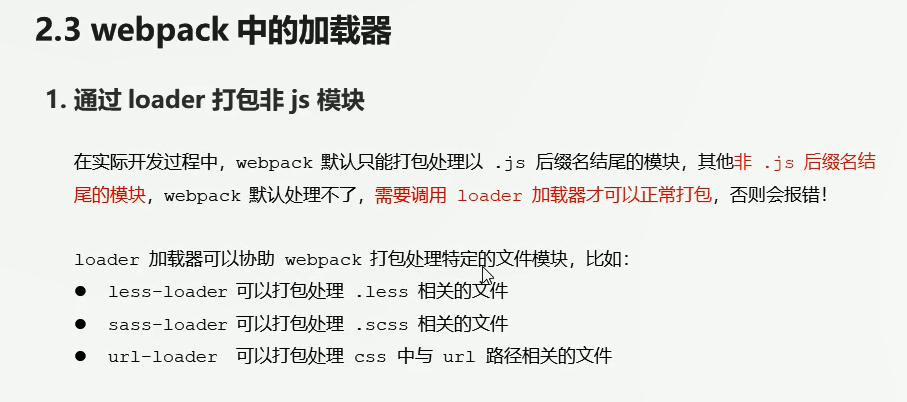
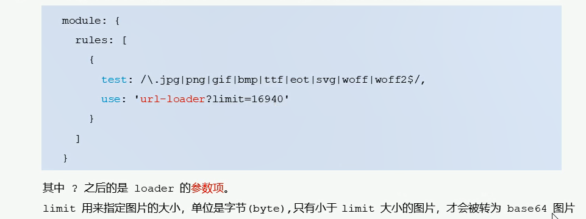
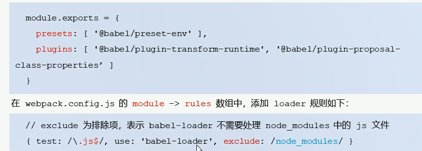
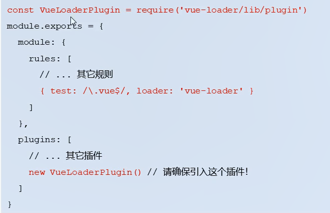
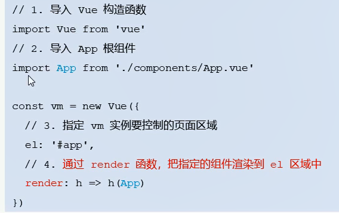

# 目录

## 在项目中安装和配置webpack

> 1. ### 运行 <span style='color:red'>`npm install webpack webpack-cli -D`</span> 命令，安装，webpack 相关的包
>
> 2. ### 在项目根目录中，创建名为 <span style='color:red'>webpack.config.js</span> 的webpack配置文件
>
> 3. ### 在webpack 的配置文件中，初始化如下基本配置
>
>    ``` js
>    module.exports={
>        mode:'development'	//mode用来指定构建模式
>    }
>    ```
>
> 4. ### 在package.json 配置文件中的 scripts 节点下，新增 dev脚本如下
>
>    ``` js
>    "scripts":{
>        "dev":"webpack"	//script节点下的脚本，可以通过npm run 执行
>    }
>    
>    ```
>
>
> 5. ### 在终端中运行 <span style='color:red'>`npm run dev`</span> 命令，启动webpack 进行项目打包
>


## 配置打包的入口与出口

> #### webpack 的 4.x 版本默认约定：
>
> > 打包的入口文件为 src -> index.js
> >
> > 打包的输出文件为 dist -> main.js
>
> 如果要修改打包的入口与出口，可以在webpack.config.js 中新增如下配置信息：
>
> ~~~ js
> const path = require('paht') //导入node.js中专门操作路径的模块
> module.exports = {
>     entry:path.join(__dirname,'./src/index.js'), //打包入口文件
>     output:{
>         path:path.join(__dirname,'./dist'), //输出文件存放路径
> 		filename:'bundle.js' //输出文件的名称
>     }
> }
> ~~~
>
> 

## 配置自动打包功能

> 1. 运行 <span style='color:red'>`npm install webpack-dev-server -D`</span> 命令  安装支持项目自动打包的工具
>
> 2. 修改 package.json -> script 中的 dev 命令如下：
>
> ``` js
> //package.json 中的配置
> //--open 打包完成后自动打开浏览器页面
> //--host 配置Ip地址
> //--port 配置端口
> "scripts":{
>        "dev":"webpack-dev-server --open --host 127.0.0.1 --port 8888" 
>    }
> 
> "scripts":{
>        "dev":"webpack-dev-server" //script 节点下的脚本，可以通过npm run 执行
>    }
> ```
>
> 3. 将 src -> index.html 中，script 脚本的引用路径，修改为 "/buldel.js"
>
> 4. 运行 <span style='color:red'>`npm run dev`</span> 命令，重新进行打包
>
> 5. 在浏览器中访问 http://localhost:8080 地址，查看自动打包效果
>
>    * <span style='color:red'> 注意：buldel.js文件为放在内存里面，虚拟的</span>
>
>    /
>
>    
>    
>    

## 版本建议

``` js
    "webpack": "^4.29.0",
    "webpack-cli": "^3.2.1",
    "webpack-dev-server": "^3.1.14"

//最新的版本可能不兼容
```


## 配置 html-webpack-plugin 生成预览页面

> 1. 运行 <span style='color:red'>npm install html-webpack-plugin -D</span> 命令，安装生成预览页面的插件
>
> 2. 修改 <span style='color:red'>webpack.config.js</span> 文件头部区域，添加如下配置信息
>
>    ``` js
>    //导入生成预览页面的插件，得到一个构造插件
>    const HtmlWebpackPlugin = require('html-webpack-plugin')
>    const htmlPlugin = new HtmlWebPlugin({ //创建插件的实例对象
>        template:'./src/index.html',//指定要用到的模板文件
>        filename:'index.html' //指定生成的文件名称，该文件存在内存中，在目录不显示
>    }) 
>    ```
>
> 3. 修改 <span style='color:red'>webpack.config.js</span> 文件中向外暴露的配置对象，新增如下配置节点
>
>    ``` js
>    module.exports={
>        plugins:[htmlPlugin] 	//plugins 数组是 webpack 打包期间会用到的一些
>    }
>    ```


## webpack中的加载器

> 
>
> 
>
> ### **打包处理css文件**
>
> > 1. 运行 <span style='color:red'>`npm i style-loader css-loader -D`</span>命令，安装处理 css文件的loader
> >
> > 2. 在 webpack.config.js的 module -> rules 数组中，添加loader 规则如下 ：
> >
> >    ```js
> >    //所有第三方文件模块的匹配规则
> >    module:{
> >        rules:[
> >            {test:/\.css$/,use:['style-loader','css-loader']}
> >        ]
> >    }
> >    ```
> >
> >    **其中，test 表示匹配的文件类型，use 表示对应要调用的 loader**
> >
> >    
>
> **打包处理less文件**
>
> > 1.运行 <span style='color:red'>npm i less-load less -D </span> 命令
> >
> > 2.在 webpack.config.js 的 module -> rules 数组中，添加 loader 规则如下：
> >
> > ```js
> > //所以第三方文件模块的匹配规则
> > module:{
> >     rules:[
> >         {test:/\.less$/,use:['style-loader','css-loader','less-loader']}
> >     ]
> > }
> > ```
>
> **打包处理scss文件**
>
> > 1.运行 <span style='color:red'>npm i sass-loader node-sass -D </span> 命令
> >
> > 2.在 webpack.config.js 的 module -> rules 数组中，添加 loader 规则如下：
> >
> > ```js
> > //所以第三方文件模块的匹配规则
> > module:{
> >     rules:[
> >         {test:/\.scss$/,use:['style-loader','css-loader','sass-loader']}
> >     ]
> > }
> > ```
> >
>
> ### 配置postCSS 自动添加 css 的兼容前缀
>
> > 1. 运行 <span style='color:red'>npm i postcss-loader autoprefixer -D</span> 命令
> >
> > 2. 在项目跟目录创建 postcss 的配置文件 postcss.config.js,并初始化如下配置
> >
> > ``` js
> > const autoprefixer = require('autoprefixer');//导入自动添加前缀的插件
> > module.exports = {
> >     plugins:[autoprefixer]	//挂载插件
> > }
> > ```
> >
> > 3. 在webpack.config.js 的module -> rules 数组中，修改css 的loader 规则如下：
> >
> >    ``` js
> >    module:{
> >        rules:[
> >            {test:/\.css$/,use:['style-loader','css-loader','postcss-loader']}
> >        ]
> >    }
> >    ```
> >
> >    
>
> ### 打包样式表中的图片和字体文件
>
> > 1. 运行 <span style='color:red'> npm i url-loader file-loader -D</span> 命令
> >
> > 2. 在webpack.config.js的 module -> rules 数组中，添加loader规则如下：
> >
> >    
> >
> > 
>
> ### 打包处理js文件中的高级语法
>
> > 1. 安装 babel 转换器相关的包：<span style='color:red'>npm i babel-loader @babel/core @babel/runtime -D</span>
> >
> > 2. 安装babel 语法插件相关的包：npm i @babel/preset-env @babel/plugin-transform-runtime @babel/plugin-proposal-class-properties -D
> >
> > 3. 在项目根目录中，创建babel 配置文件 babel.config.js 并初始化基本配置如下
> >
> >    
> >
> >    
> >
> > 出现问题就执行这个 npm install -D babel-loader @babel/core @babel/preset-env webpack
>
> ### 配置vue组件的加载器
>
> > 1. 运行 <span style='color:red'>  npm i vue-loader vue-template-compiler -D </span> 命令
> >
> > 2. 在 webpack.config.js 配置文件中，添加 vue-loader 的配置项如下
> >
> >    
> >
> >    
> >
> >    
>
> ### 在webpack 项目中使用vue
>
> > 1. 运行 npm i vue -S 安装vue
> >
> > 2. 在src -> index.js 入口文件中，通过import Vue from 'vue' 来导入 vue 构造函数
> >
> > 3. 创建 vue 的实例对象，并指定 要控制的 el 区域
> >
> > 4. 通过 render 函数渲染 App 根组件
> >
> >    
>
> ### webpack打包发布
>
> 上线之前需要通过 webpack 将应用进行整体打包，可以通过 package.json 文件配置打包命令
>
> ``` json
> //在package.json 文件中配置 webpack 打包命令
> //该命令默认加载项目跟目录的 webpack.config.js 配置文件
> "scripts":{
>     //用于打包命令
>     "build":"webpack -p",
>      //用于开发调试的命令
>      "dev":"webpack-dev-server --open --host 127.0.0.1 --port 3000"
> }
> ```
>
> 


