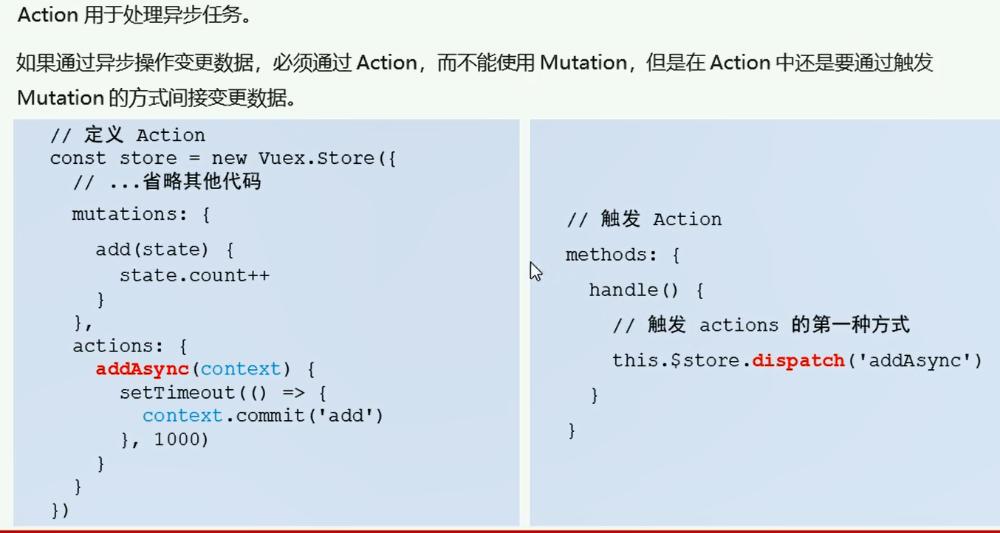
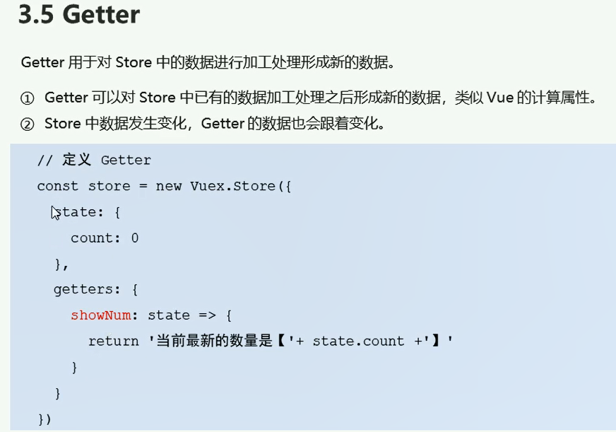

## Vuex是什么

> ​	<span style='color:red'> Vuex</span>是实现组件全局状态（数据）管理的一种机制，可以方便的实现组件之间的数据共享

### 基本使用

> 1. 安装Vuex依赖包
>
> 2. 导入Vuex包
>
>    ```js
>    import Vuex from 'vuex'
>    Vue.use(Vuex)
>    ```
>
> 3. 创建store对象
>
>    ```js
>    const store = new Vuex.Store({
>        //state 中存放的就是全局共享的数据
>        state:{ count: 0 }
>    })
>    ```
>
> 4. 将store 对象挂载到 Vue实例中
>
>    ```js
>    new Vue({
>        el:'#app',
>        render:h=h(app),
>        router,
>        //将创建的共享数据对象，挂载到Vue实例中
>        //所以的组件，就可以直接从 store中获取全局的数据了
>        store
>    })
>    ```
>
>
> 



