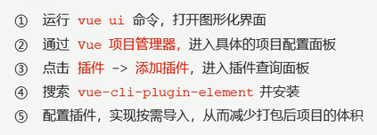
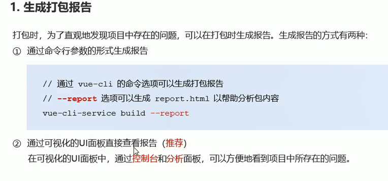

## vue脚手架的基本用法

> vue脚手架用于快速生成vue项目基础架构，官网为：https://cli.vuejs.org/zh

### 使用步骤

> 1. 安装3.x版本的Vue脚手架
>
>    <span style='color:red'>`npm install -g @vue/cli`</span>

***


> 1. 基于 交互式命令行 的方式 创建 新版 vue项目
>
>    vue create my-project
>
> 2. 基于 图形化界面 的方式，创建新版vue项目
>
>    vue ui
>
> 3. 基于2.x的旧版本，创建旧版本 vue项目
>
>    npm install -g @vue/cli-init
>
>    vue init webpack my-project
>
> 

### 通过package.json 配置项目

``` json
 "vue":{
    "devServer":{
      "port":8888,
      "open":true
    }
  }
```

<span style='color:red'>注意</span>：不推荐使用这种配置方式，因为package.json 主要用来管理包的配置信息，为了方便，推荐将vue脚手架相关的配置，单独定义到vue.config.js 配置文件中。

### 通过单独的配置文件配置项目

> 1. 在项目的跟目录创建文件 vue.config.js
>
> 2. 在该文件中进行相关配置，从而覆盖默认配置
>
>    ``` js
>    //vue.config.js
>    module.exports = {
>        devServer:{
>            port:8888,
>            open:true
>        }
>    }
>    ```
>
>    

### element ui 的使用

> Element-Ui：一套为开发者，设计思和产品经理准备的基于Vue 2.0 的桌面端组件库，
>
> 1.基于命令行的手动安装
>
> * 安装依赖包 npm i element-ui -S
> * 导入element-ui 相关资源
>
> ```js
> //导入组件库
> import ElementUI from 'element-ui';
> //导入组件相关的样式
> import 'element-ui/lib/theme-chalk/index.css';
> //配置Vue插件
> Vue.use(ElementUI)
> ```
>
> 

element ui 的使用 图形化自动安装

> 

## 项目优化

> 

